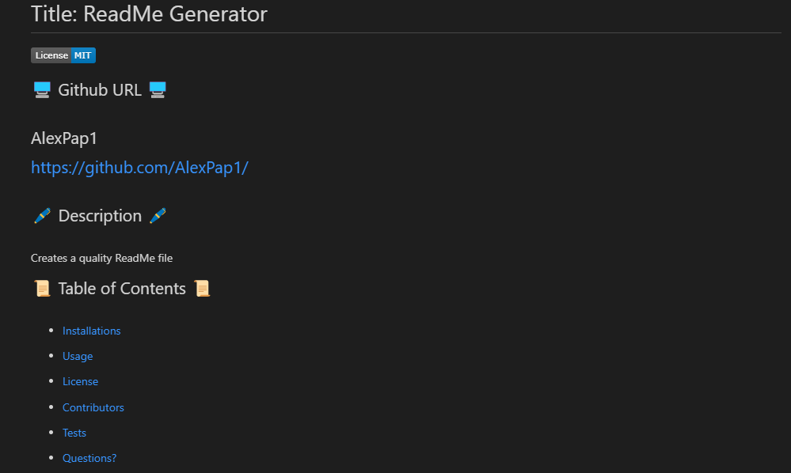

ReadMe Generator
===============================================================================================================

This Repo will generate a quality ReadMe.md file that follows a detailed template.
---------------------------------------------------------------------------------------------------------------

---------------------------------------------------------------------------------------------------------------

GitHub: https://github.com/AlexPap1/READ-ME-Generator
 
GitHub Pages: https://alexpap1.github.io/READ-ME-Generator/ 
 
TUTORIAL VIDEO: https://drive.google.com/file/d/1xPnEA3t2domtTLPiWng5BdaF3tVlxWE3/view

---------------------------------------------------------------------------------------------------------------

**Issue**
 
AS A developer
I WANT a README generator
SO THAT I can quickly create a professional README for a new project

---------------------------------------------------------------------------------------------------------------

---------------------------------------------------------------------------------------------------------------

This Repo contains sections for a ReadMe including Description, Installation, Usage, Licenses, Contributing, Tests, Questions, and a Table of Contents
 
 
The License adds a badge if one is selected in Inquirer, and will create a license section in the ReadMe along with a Table of Contents link to that section. (The Table of Contents also links to the other sections 🙂)
 
 
The Readme will also accept input for the Repo Title (displayed at the top), and GitHub username/email. The user and email are used for the questions section to contact the repo owner. This also includes a direct email link and github link
 
 
Extra Info Provided by Rutgers:
 
 
Professional README Generator Starter Code:

[How to create a Professional README](https://coding-boot-camp.github.io/full-stack/github/professional-readme-guide)
 
Thank you for viewing 🤝
